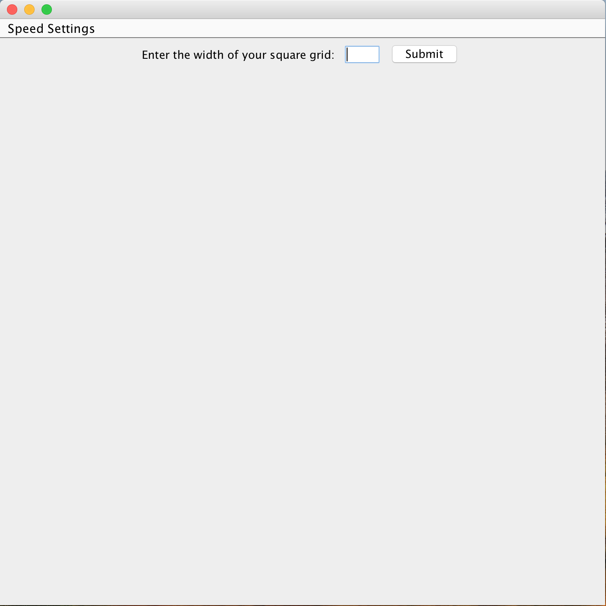
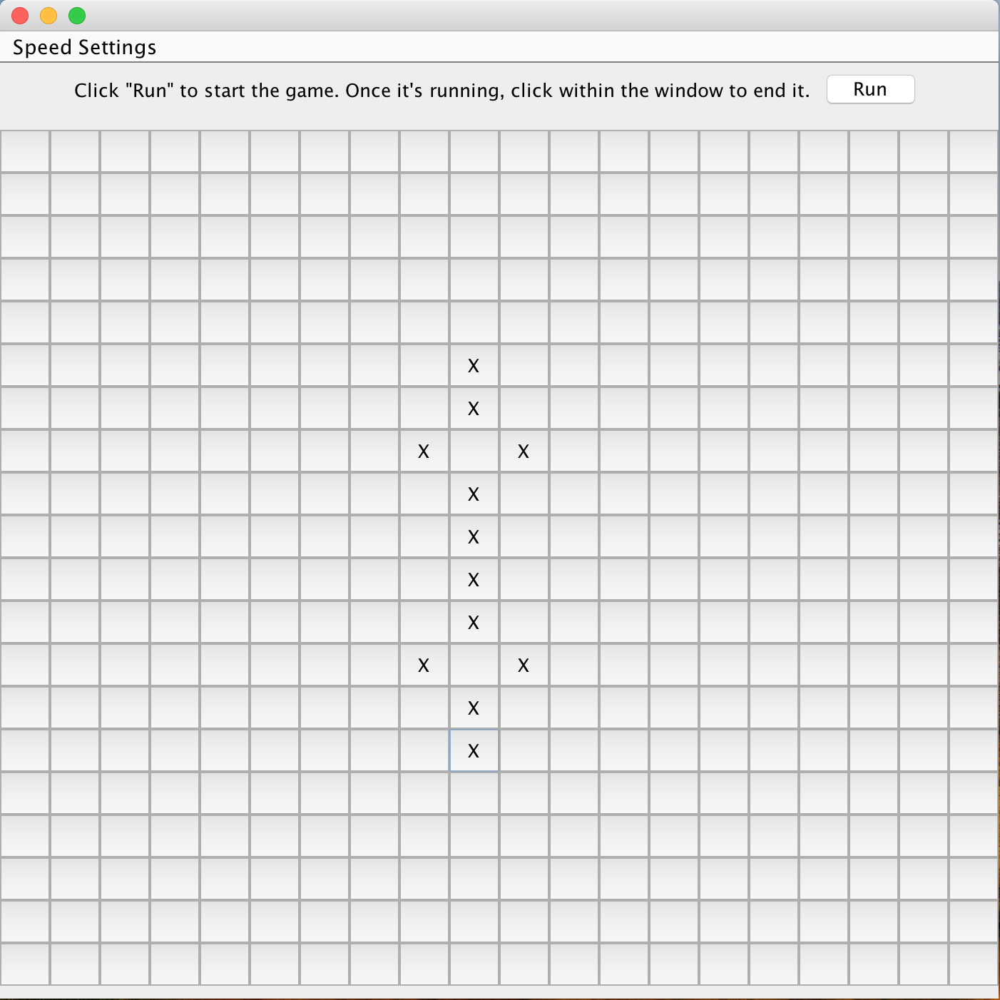
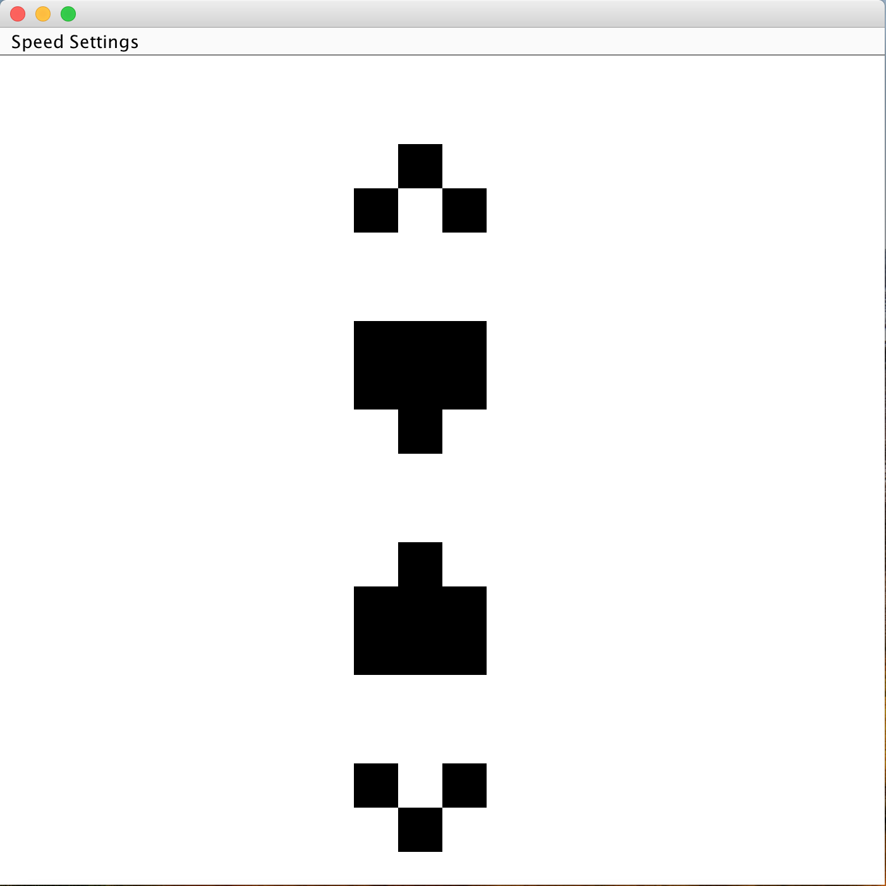

# Game of Life 
This program is an implementation of John Conway's Game of Life (https://en.wikipedia.org/wiki/Conway%27s_Game_of_Life)  
It simulates a population of "cells" and determines whether each cell living cell should live or die, and whether new cells should be born.

## The Rules
1. Any live cell with fewer than two live neighbors dies, as if caused by under population.
2. Any live cell with two or three live neighbors lives on to the next generation.
3. Any live cell with more than three live neighbors dies, as if by overpopulation.
4. Any dead cell with exactly three live neighbors becomes a live cell, as if by reproduction.

## Screenshots

## Note
- Black represents living cells
- Entering over 50 on the width of the grid will make it hard or impossible to see whether you have selected a space on the grid
  
